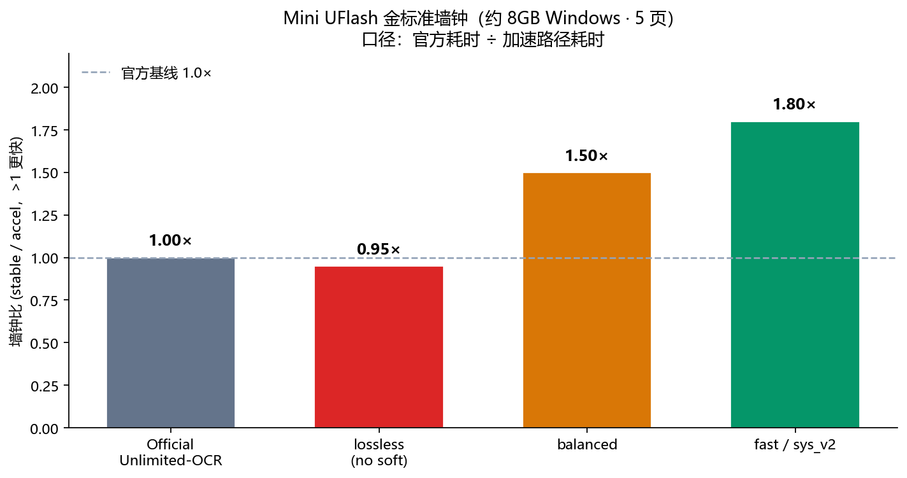
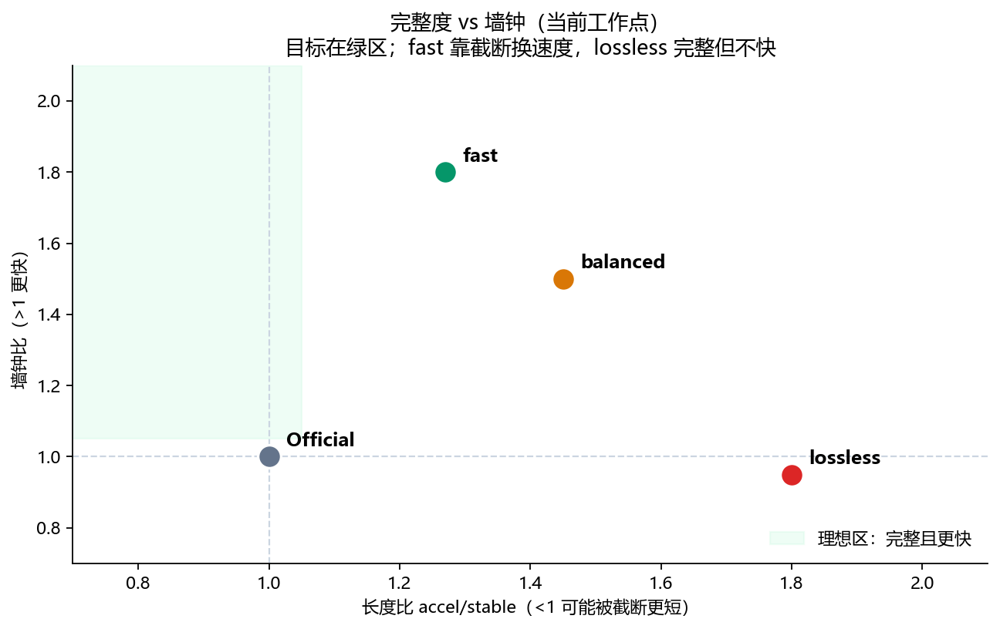
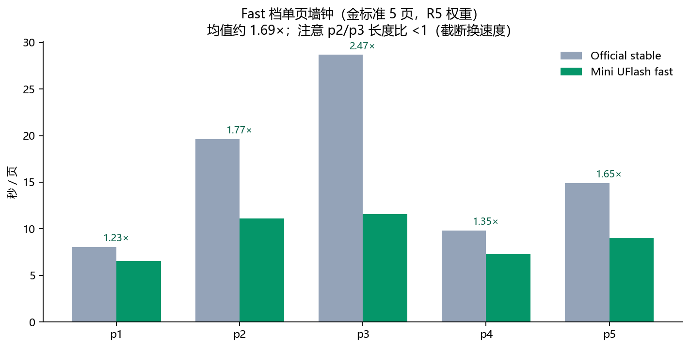
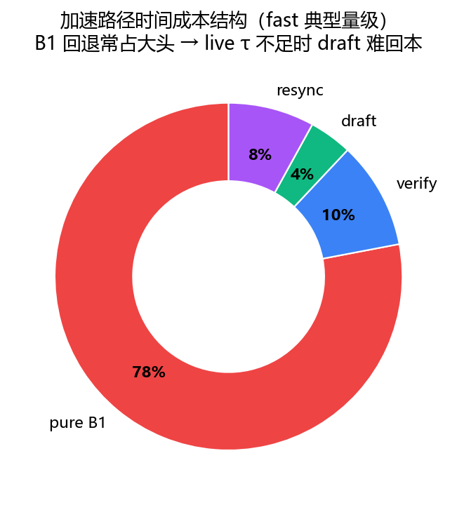
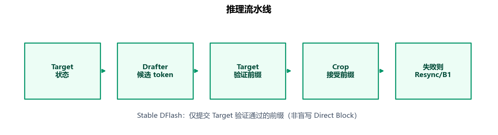
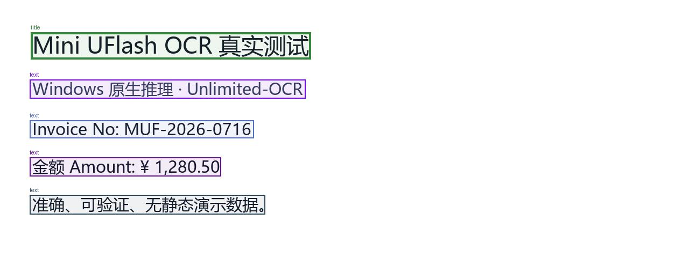

# Mini UFlash

**为 Unlimited-OCR 探索 Windows 本地投机解码**

面向 **8GB 级 Windows 设备**、受 **DFlash / 混元 OCR** 思路启发的 **Unlimited-OCR 投机解码参考实现**。

[](docs/ANNOUNCEMENT.md)
[](https://github.com/ZhiYiTree/mini-uflash-ocr-windows/discussions/1)
[](https://github.com/ZhiYiTree/mini-uflash-ocr-windows/releases/tag/v1.0.0)

> **Research Preview。** 链路可运行、可测量、失败可复现；**尚未**达到「完整输出下稳定高倍加速」。  
> 完整开源说明：[Discussion #1](https://github.com/ZhiYiTree/mini-uflash-ocr-windows/discussions/1) · [docs/ANNOUNCEMENT.md](docs/ANNOUNCEMENT.md) · [docs/HONEST_STATUS.md](docs/HONEST_STATUS.md)

<p align="center">
  
</p>
<p align="center"><sub>本地 Gradio 网页：普通版（官方 Unlimited-OCR）与加速版（Stable DFlash + 三档）</sub></p>

---

## 从哪里来

混元 OCR 可以通过 DFlash 类草稿模型减少逐 token 解码。一个很直接的问题是：

> **类似思路能否迁移到 Unlimited-OCR，并在 Windows 本地设备上跑通？**

经过训练与工程适配，项目已经串起：

**草稿模型训练 → 本地推理 → 固定页 A/B 墙钟 → 失败记录。**

需要先说清楚：

- 它**已经可以运行和测量**；
- 它**还没有**证明「无损、完整输出、稳定显著快于官方」；
- 当前更亮眼的墙钟数字，**很大一部分来自长度策略（soft/hard 截断）**，而不是纯高接受率投机。

---

## 三分钟看懂：成果 vs 差距

<p align="center">
  
</p>

| 模式 | 相对官方速度（约） | 输出特征 |
| --- | ---: | --- |
| Official Unlimited-OCR | **1.00×** | 官方基线 |
| **lossless**（无 soft 截断） | **~0.95×** | 更完整，**暂未实现加速** |
| **balanced** | **~1.5×** | 软帽放宽；完整度好于 fast |
| **fast / sys_v2** | **~1.7–1.9×** | soft/hard 截断换墙钟 |

墙钟口径：`官方 stable 耗时 ÷ 加速路径耗时`（**>1 表示加速更快**）。  
环境：Windows · 约 **8GB** 笔记本 GPU · 金标准 **5 页**（详见 [`train/GOLD_BASELINE.md`](train/GOLD_BASELINE.md)）。

<p align="center">
  
</p>

**读图：** 理想区在「完整且更快」。当前 **fast 在图左上**（快，但长度比偏低、可能被截断）；**lossless 在图右下**（更完整，但不快）。**还没有进入绿区。**

### Fast 档单页（真实测时）

<p align="center">
  
</p>

| 页 | stable | fast | 墙钟比 | 长度比 | 备注 |
| --- | ---: | ---: | ---: | ---: | --- |
| p1 | 8.1s | 6.5s | **1.24×** | 1.56 | 略长 |
| p2 | 19.6s | 11.1s | **1.77×** | **0.84** | 输出更短 |
| p3 | 28.7s | 11.6s | **2.47×** | **0.77** | 截断贡献大 |
| p4 | 9.8s | 7.3s | **1.35×** | 2.42 | 膨胀 |
| p5 | 14.9s | 9.0s | **1.65×** | **0.77** | 输出更短 |
| **均值** | **16.2s** | **9.1s** | **~1.69×** | **~1.27** | R5 · fast |

### 成本结构：为什么「完整时」难快？

<p align="center">
  
</p>

在线观测量级：

| 指标 | 约值 |
| --- | --- |
| live τ（mean accepted draft） | **1.1～1.4** |
| pure B1 时间占比 | 经常 **>70%** |
| lossless 长度比 | 约 **1.8** |

τ 不够时，draft + verify 很难回本；系统只能靠 **停写 / 截断** 保墙钟——这正是用户感到「截断太狠」的原因。

---

## 当前实现

| 模块 | 说明 |
| --- | --- |
| Windows 原生网页 | Gradio，图片 / PDF 逐页 |
| 官方 Unlimited-OCR | 稳定质量基线 |
| R5 草稿权重 | [Release v1.0.0](https://github.com/ZhiYiTree/mini-uflash-ocr-windows/releases/tag/v1.0.0) |
| Stable DFlash | 前缀验证 · KV crop · 失败 resync |
| 三档 | **fast** / **balanced** / **lossless** |
| A/B 基准 | 固定 manifest，官方 vs 加速 |
| 成本拆分 | draft / verify / resync / B1 |
| 8GB 训练脚手架 | TV / Markov / pos0 等 |
| conf 校准 | 温度缩放 + verify_len 调度 |

<p align="center">
  
</p>

相对「盲写 commit」实验路径，这里强调：**只有 Target 验证通过的前缀才写入状态**。

<p align="center">
  
</p>

<p align="center">
  
</p>
<p align="center"><sub>官方路径检测 / 版式样例（smoke）；加速路径在**文本解码**侧投机，布局仍由 Unlimited-OCR 决定</sub></p>

---

## 必须说明的限制

1. **Fast 的快与截断绑定**  
   soft≈280 / hard≈384 等策略会让长文、表格、复杂版式**更早结束**。更快 ≠ 更完整。

2. **关掉 soft 之后**  
   lossless **≈0.95×** 官方速度——**现有权重不支持「完整 + 稳定更快」**。

3. **训练尚未打通下一跳**  
   R5 为生产点；**R6 同分布再训未超过 R5**（失败记录保留）。  
   train/infer 分布错位、free-run hard mining **尚未验证有效**。

4. **测法局限**  
   金标准仅 5 页；未覆盖全部文档类型与硬件；质量指标（相对官方文本）仍弱于速度数据。

| 容易说满 | 更准确 |
| --- | --- |
| 「1.8× 无损加速」 | 「可截断策略下约 1.7–1.9×；无损约 0.95×」 |
| 「训练大幅拉高墙钟」 | 「R5 后墙钟跃迁主要来自调度；R6 失败」 |
| 「已对齐混元 DFlash」 | 「受其启发的迁移探索；条件不同」 |

---

## 快速开始（克隆后可用）

Unlimited-OCR 约 **6GB+**，**不能**放进 Git（平台限制）。安装脚本会从 Hugging Face 拉取 OCR，并从 **Release** 拉取约 32MB 草稿权重。

```powershell
git clone https://github.com/ZhiYiTree/mini-uflash-ocr-windows.git
cd mini-uflash-ocr-windows

Set-ExecutionPolicy -Scope Process -ExecutionPolicy Bypass
.\setup_full.ps1          # 环境 + Unlimited-OCR + 生产权重
.\launch_webapp.ps1       # 或双击「启动前端.bat」
```

浏览器：<http://127.0.0.1:7860>

| 处理方式 | 建议 |
| --- | --- |
| 普通版 · 稳定 | 官方质量基线 |
| 加速 · **fast** | 墙钟优先（可能截断） |
| 加速 · **balanced** | 更完整一点 |
| 加速 · **lossless** | 最完整；当前未必更快 |

路径与环境变量见 [`weights/README.md`](weights/README.md)、[`文件说明.md`](文件说明.md)。

### 验证

```powershell
.\.venv\Scripts\python.exe -m pytest webapp\tests -q
.\download_models.ps1 -CheckOnly
.\.venv\Scripts\python.exe -u train\bench_stable_vs_direct.py --manifest train\bench_manifest_fast.json
```

---

## 为什么现在开源

- 基础链路可运行；性能可测量；失败可复现；瓶颈逐渐明确。  
- 希望把 **代码、权重获取、基准、失败记录** 摊开，一起判断：  
  速度来自哪里？截断牺牲了什么？如何抬 live τ？如何建更公平的 OCR 加速基准？

欢迎阅读并回复：[Discussion #1](https://github.com/ZhiYiTree/mini-uflash-ocr-windows/discussions/1)。

---

## Help Wanted

| 方向 | 需要什么 |
| --- | --- |
| **Hard mining** | free-run 失败前缀，验证能否抬 **live τ** |
| **质量评估** | 相对官方文本差异、截断删了什么、表格/多栏 |
| **多机复现** | 6–16GB、各代 RTX、SDPA/eager；带环境与 τ/B1 |
| **Cache / verify** | 降 B1、降 resync、完整输出下的调度 |
| **工程文档** | 安装、UI、教程、基准脚本 |

Issue 请尽量包含：**GPU / 显存 / 软件栈 / 档位 / 双方耗时与长度 / τ / B1 / 复现步骤**。  
不要只写「快了」或「慢了」。

---

## 仓库地图

```text
webapp/          网页 + Stable DFlash 引擎 + 三档
train/           8GB 续训、金标准 manifest、校准
docs/            开源说明、诚实评估、README 配图
weights/         仅 README（.pt 走 Release）
models/          本地 OCR（gitignore，脚本下载）
```

| 文档 | 内容 |
| --- | --- |
| [docs/ANNOUNCEMENT.md](docs/ANNOUNCEMENT.md) | 开源长文（与 Discussion 同步） |
| [docs/HONEST_STATUS.md](docs/HONEST_STATUS.md) | 成果 / 不足细表 |
| [train/GOLD_BASELINE.md](train/GOLD_BASELINE.md) | 金标准测法与分档数据 |
| [train/STATUS.md](train/STATUS.md) | 训练与调度演进 |

---

## 当前定位

> 一套可在 **8GB 级 Windows** 上运行的 **Unlimited-OCR 投机解码参考实现**（训练脚手架 · 推理 · 测量 · 失败记录）。  
> **尚未**对齐「混元式无损高倍加速」。

它已经证明：**这条迁移路线可以被实现。**  
它还没有证明：**这条路线已经被解决。**

成功的实验会留下。失败的实验也会留下。

---

## 许可证与上游

- Unlimited-OCR：遵循其 Hugging Face / 官方许可证。  
- 本仓库应用与脚手架：欢迎 Issue / PR；请注明环境与是否完成 `setup_full.ps1`。
